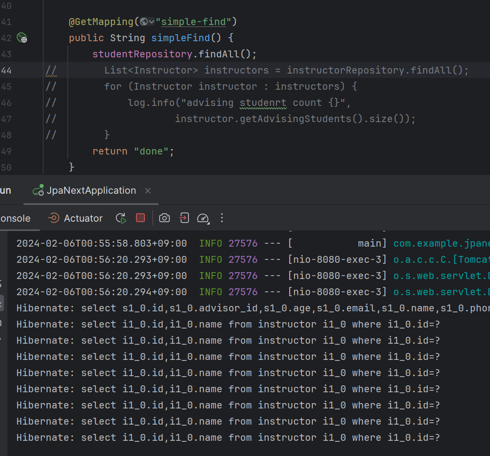
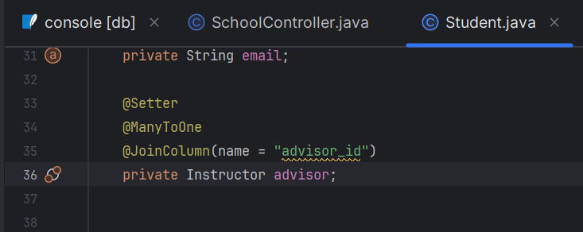
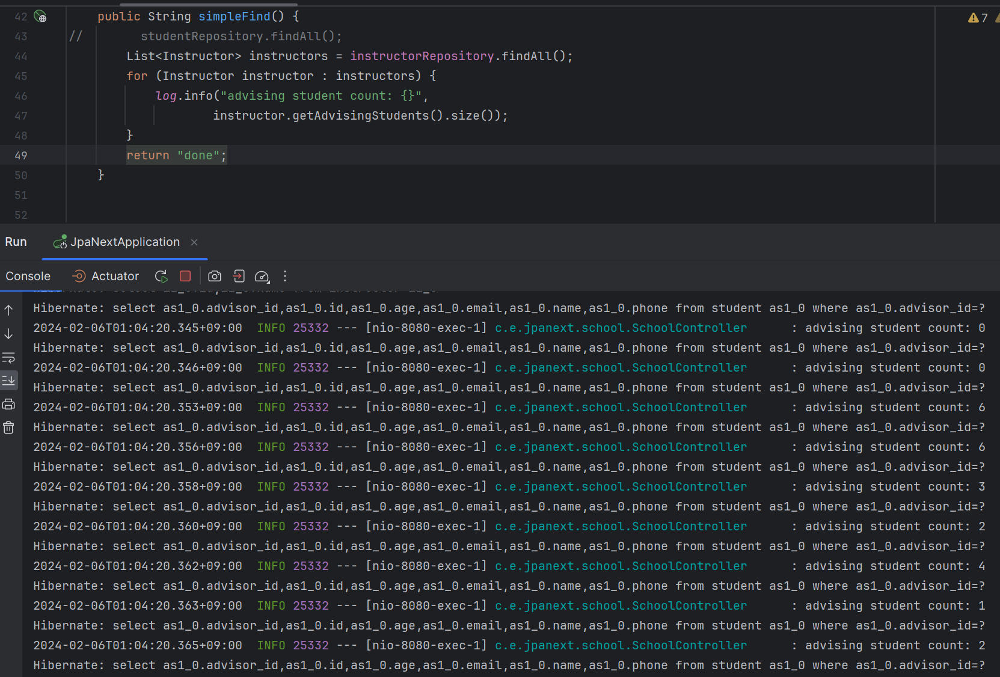
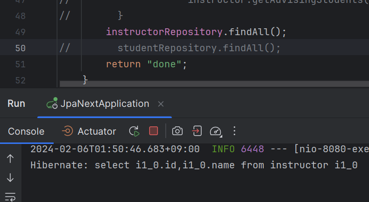
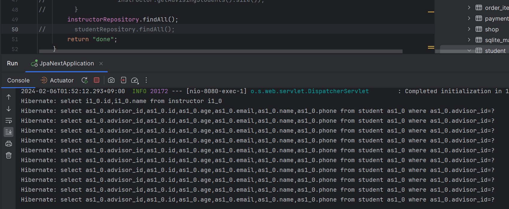
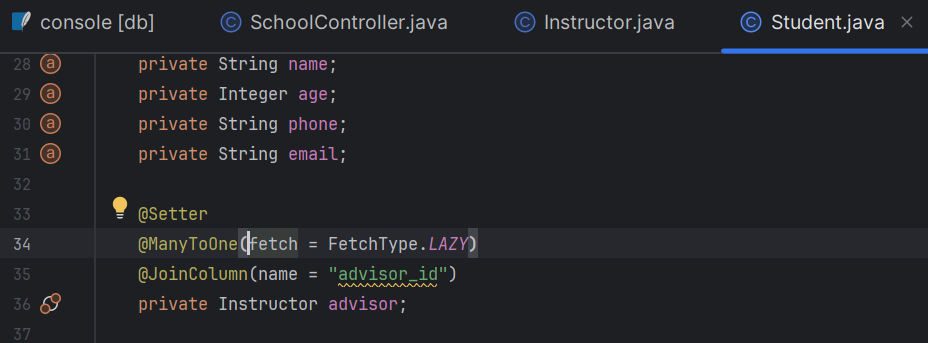
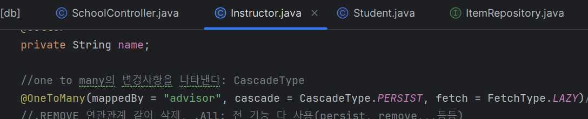
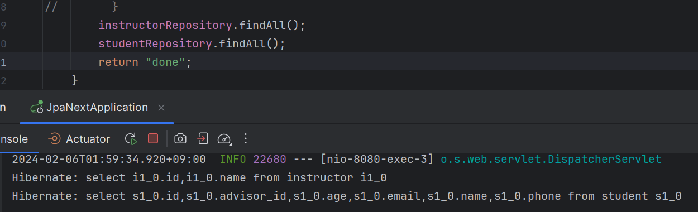
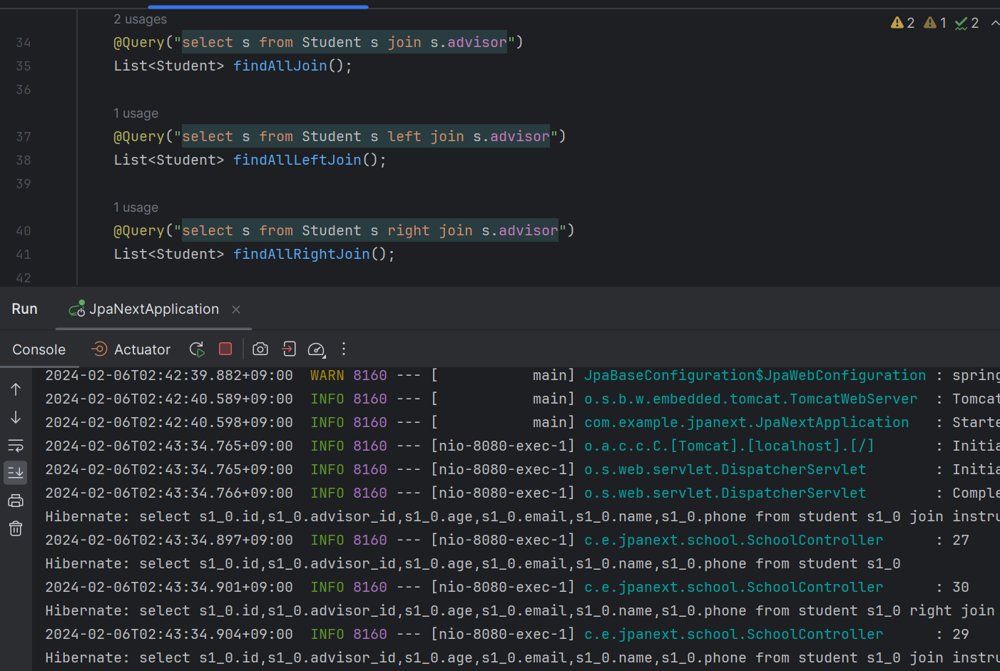
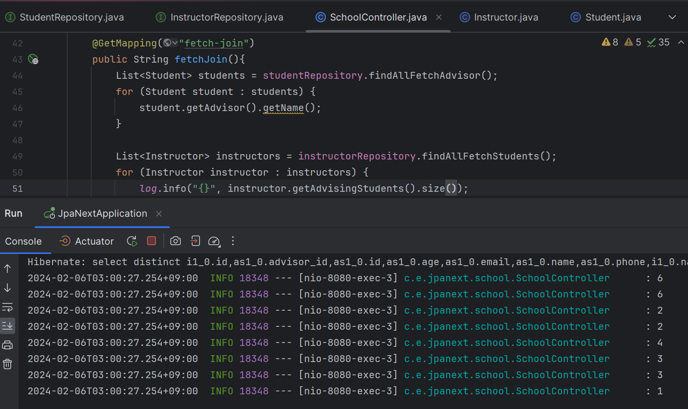

# N + 1 정리

방법 1.(일단 디폴트로 무조건?)
fetch eager: 조회를 하는 순간에 연관되어 있는 데이터들을 모두 조회를 한다. 기본값 ManyToOne => n+1이 항상 발생   
fetch lazy: 데이터를 필요로 하는 시점에 추가적으로 요청을 한다.
기본값 OneToMany  
연관관계를 타나내는 one to many, many to one 어노테이션에 lazy를 넣어준다.  
@OneToMany(fetch = FetchType.LAZY)  
one to many는 기본이 lazy이지만 그래도 명시적으로 넣어주는게 좋다.

방법 2. Join을 사용한다.  
```java
@Query("select distinct s from Instructor s join fetch s.advisingStudents")
List<Instructor> findAllFetchStudents();  
```

이렇게 해야한다. 그래야 쿼리를 하나 사용해서 원하는 값을 가지고 올 수 있다.

방법 3. @EntityGraph를 사용한다.
```java
@EntityGraph(attributePaths = {"advisingStudents"}, type = EntityGraph.EntityGraphType.FETCH)
@Query("select DISTINCT i from Instructor i")
List<Instructor> findByEntityGraph();
```

이 방법도 쿼리를 하나 사용해서 원하는 값을 가지고 올 수 있다.


# N + 1

연관관계를 조회할 때 나오는 jqp(orm)의 오류(?)  

.findAll을 했을 때  
단지 student테이블을 select * 했을 뿐인데 너무 많은 select들이 나온다.  
첫번째 줄은 우리가 원하는 코드가 맞다.



두번째 줄부터는 from instructor이다.  
왜냐하면 Student테이블은 @ManyToOne으로 Instructor테이블과 연결이 되어있기 때문이다. 그래서 조회를 한다.  
Student가 가지고 있는 advisor을 바탕으로 instructor에서 정보를 꺼내오자라는 쿼리이다.



또한 이렇게 하면 Instructor의 정보를 가져오기 위해 10번을 반복한다.



이것은 문제이다!!  
데이터베이스로는  
select * from student;  
select * from student s inner join instructor i on s.advisor_id = i.id;  
이렇게 할 수 있다.

이런 이유는 연관관계 데이터가 항상 필요하지 않고, ORM 기술은 상황에 따라 필요한 데이터를 나중에 조회하도록 만들어지는 경우가 많다.  
이렇게 하는 이유는 지금하는 방식으로는 연관관계 데이터가 필요한지 필요하지 않은지 바로 인지 할 수 없기 때문이다.  
그러다 보니 JPA에서 판단을 해서 필요한 시점에 조회를 하기 위함이다. => Proxy  
Many To One관계 Entity는 Proxy객체  
One To Many관계 Collection은 PersistentBag

하지만 이렇게 성능 향상을 위한 기능을 만들었지만 이게 성능을 저하시키는 원인이 되고 있다.

이렇게 필요할 때 가져오는 것은 필요한 sql이 갑자기 증가하는 거여서 성능을 저하시키게 된다.

강사를 조회하고 강사의 학생을 조회할 때 강사의 학생들을 조회하는 쿼리가 하나 더 추가가 되는 것이다.  
즉 강사를 조회하고 1, 강사의 학생을 조회하기 위해 학생 수 만큼 학생을 조회 N번을 해서 N + 1이라고 한다.

내가 실제로 조회를 한 쿼리보다 더 많은 양의 쿼리를 날렸다 => orm의 n + 1문제  
ORM프레임워크가 가진 성능에 대한 고민 때문에 발생한 문제. 전체를 조회하는데 한번, 전테랑 연관된걸 조회하는걸 한번씩 조회.

(30명이라고 다 조회하지 않는다. 중복이 발생하면 뺀다. 하지만 여전히 많은 조회가 발생한다.)

즉시로딩(eager loading): 조회를 하는 순간에 연관되어 있는 데이터들을 모두 조회를 한다.  
기본값 ManyToOne => n+1이 항상 발생

지연로딩(lazy loading): 데이터를 필요로 하는 시점에 추가적으로 요청을 한다.  
기본값 OneToMany


해결방법:  
fetch를 사용.  
모두 지연로딩으로 바꾸어 준다.  

OneToMany에 즉시로딩을 하지 않은경우  
 

one to many에 즉시로딩을 건 경우
```java
@OneToMany(mappedBy = "advisor", cascade = CascadeType.PERSIST, fetch = FetchType.EAGER)
private final List<Student> advisingStudents = new ArrayList<>();
```


조회를 하는 순간에 연관되어 있는 데이터들을 모두 조회를 하게 된다.

결론  
모두 지연로딩으로 바꾼다.

  
  



jqpl join



데이터를 가져오는  join이 아니라
연관관계의 데이터를 확인하는 용도의 join
where을 사용하고 싶을 때 사용.

```java
@Query("select s from Student s join s.advisor where s.advisor.name = :name")
List<Student> findAdvisorName(@Param("name") String name);
```
# 실제로 사용할 Join
실제로 join을 사용하고 싶을 때  
Fetch Join이라고 한다.
```java
@Query("select s from Student s join fetch s.advisor")
List<Student> findAllFetchAdvisor();
//명확하게 성능이슈를 타겟팅하기 위한 기능
```

사용하면 쿼리를 하나만 사용하여 join을 사용할 수 있다.



다른방법 @EntityGraph

```java
//jpa가 제공하는 entityGraph를 설정하기 위한 방법
//조회를 하는 시점에 fetch type을 조정을 하기 위함.
//fetch type은 지정해 놓으면 실행할 때 fetch type 조정이 불가능하다.
//동적으로 fetch type을 조정해주기 위함.
@EntityGraph(attributePaths = {"advisingStudents"}, type = EntityGraph.EntityGraphType.FETCH)
@Query("select DISTINCT i from Instructor i")
List<Instructor> findByEntityGraph();
```