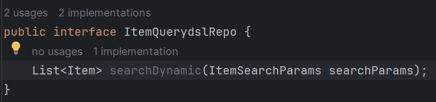
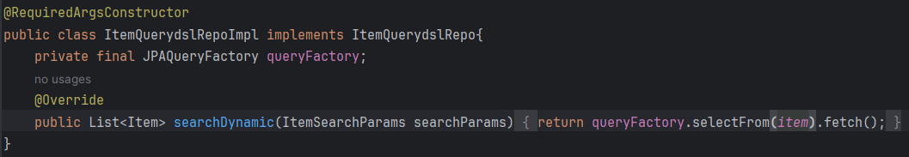
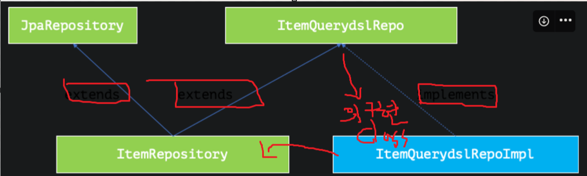
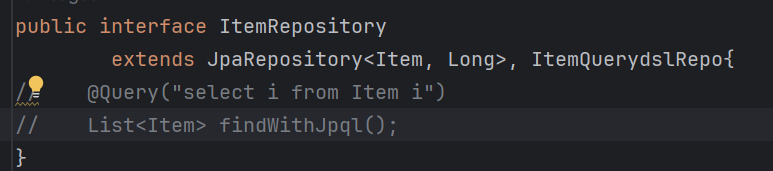
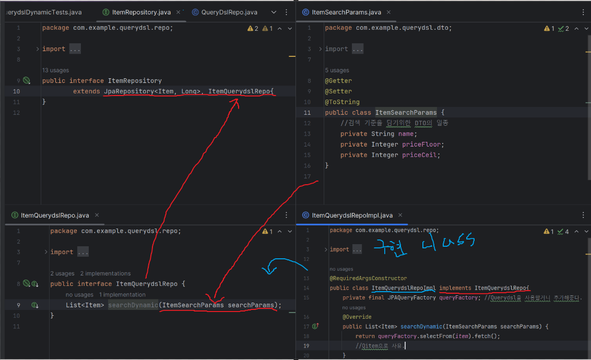
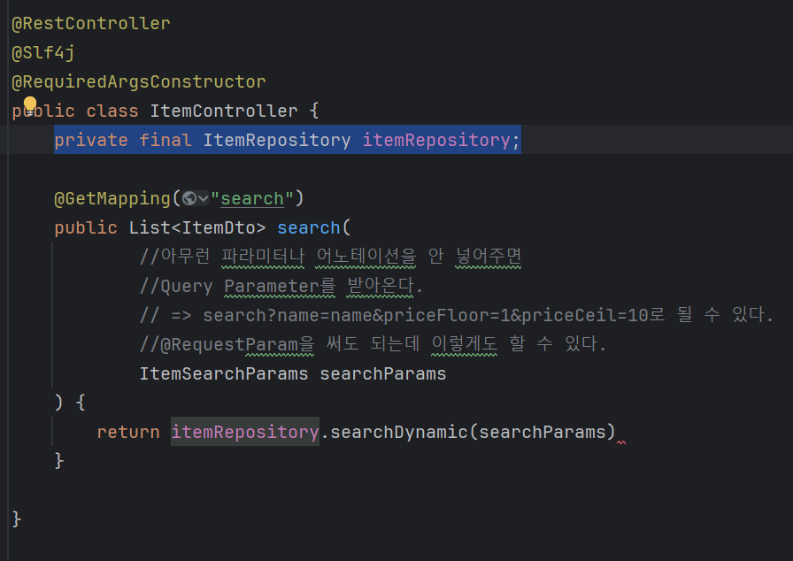

# JpaRepository에 Querydsl을 같이 사용하는 방법
두가지를 동시에 사용하고 싶을 경우.

JpaRepository의 기능을 확장하여 Querydsl의 기능을 덧붙일 수 있다.

### Jpa에 Querydsl 입히기!
인터페이스를 만들고 그 구현체를 만들자.

1. ItemQuerydslRepo 인터페이스 만들기
      
    여기에 실제로 구현할 기능들에 대한 메서드 정의가 추가되어야 한다.
2. ItemQueryRepoImpl 구현체 클래스 만들기: ItemQuerydslRepo를 상속받는다.  
      
    private final JPAQueryFactory queryFactory; : Querydsl을 사용할거니까 추가해준다.     
    ItemQueryRepoImpl의 구현체를 bean의 이름을 바탕으로 찾는다.  
    "...Impl" 이라는 클래스를 찾는다. 그래서 구현체 이름을 Impl이라고 끝내야 한다.  
    ItemRepository는 ItemQueryRepoImpl의 구현체인 ItemQueryRepoImpl 클래스를 가져다 사용하게 된다.  
    
3. ItemRepository 인터페이스에 ItemQueryRepoImpld과 JpaRepository를 다중상속 받는다.
    

  

이제 컨트롤러에서 private final ItemRepository itemRepository; 하나로 해결 할 수 있다.  
