할지말지 상홯에 따라 하는 방법: 호출을 한다. 호출을 하지 않는다.

null이냐 아니냐에 따라 조건을 추가할 것인지 안할것인지를 해보겠다.
```java
    @Test
    public void dynamicQueryTester() {
        List<Item> results = null;
        String name = "itemA";
        Integer price = 5000;
        Integer stock = 20;

        results = booleanBuilder(name, price, stock);
        results.forEach(System.out::println);

        results = booleanBuilder(name, null, null);
        results.forEach(System.out::println);

        results = booleanBuilder(null, null, stock);
        results.forEach(System.out::println);

        results = booleanBuilder(null, price, stock);
        results.forEach(System.out::println);
        //결과자체는 데이터가 별로 없어서 독깥이 나올텐데 실행을 할 때마다 나오는 쿼리가 달라진다라는 것을 주목하라.
    }

    public List<Item> booleanBuilder(
            String name,
            Integer price,
            Integer stock
    ) {
        // 1. BooleanBuilder: 여러 조건을 엮어서 하나의 조건으로 만들어진
        //                    BooleanBuilder를 사용하는 방법
        BooleanBuilder booleanBuilder = new BooleanBuilder(item.name.isNotNull());//item.name.isNotNull(): 생성자에 초기 조건 상정 가능
        // 여태까지 누적된 조건에 대하여, 주어진 조건을 AND로 엮는다.
        if (name != null) //name이 주저졌을 때는 조건이 추가가 되지만 name이 주어지지 않았을 때에는 조건이 추가가 되지 않는다.
            // (여태까지의 조건) AND i.name = name
            booleanBuilder.and(item.name.eq(name));//and 다음에 오는 조건을 추가를 해주자.
        if (price != null)
            // (여태까지의 조건) AND i.price = price
            booleanBuilder.and(item.price.eq(price));
        if (stock != null)
            // (여태까지의 조건) AND i.stock = stock
            booleanBuilder.and(item.stock.eq(stock));
        return queryFactory
                .selectFrom(item)
                .where(booleanBuilder)
                .fetch();
    }
```
첫번째 조건 실행  
results = booleanBuilder(name, price, stock);  
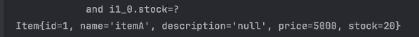

두번째 조건 실행  
results = booleanBuilder(name, null, null);  
name만 주어졌기 때문에 name만 검증을 한다.  
결과는 똑같지만 where문이 조금 다르다.  
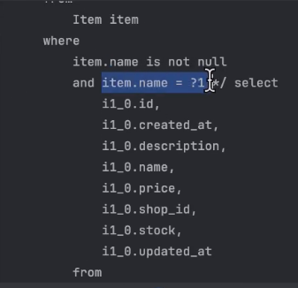

세번째 조건 실행  
results = booleanBuilder(null, null, stock);  
stock만 주어졌기 때문에 stock만 검증을 한다.  
결과는 똑같지만 where문이 조금 다르다.  
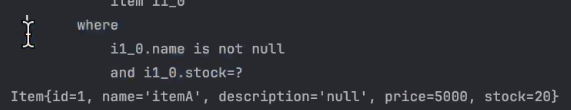

## .where() 동적쿼리
BooleanBuilder는 객체로 되어있어서 그걸 and해줘야 하는거이기 때문에 밖으로 빼주기가 어렵다. 그 과정이 메서드의 본체에 다 들어가 있어야 한다. (코드를 불리해서 사용하기 불리하다.)
BooleanExpression을 만들어서 where절에다가 지급을 하자!

where은 자신에게 전달된 인자들이 AND로 엮이는 한편, 주어진 인자 중 null을 무시한다는 특성을 이요해서 동적 쿼리를 작성하는 방식이다.

where은 BooleanExpression 이라는 클래스를 인자로 받을 수 있으니, BooleanExpression을 반환하는 메서드를 만들 수 있다.

이 방식은 BooleanBuilder에 비해 실제 조회하는 과정의 구조가 단순화되어 코드의 가독성이 높아집니다. 또한 메서드의 형태로 조건을 정의하는 만큼, 여러 조건을 엮어야 되는 상황에서 코드 재사용성을 높일 수 있습니다. 

### where 사용하여 동적 쿼리를 만들어보자.

```java
 @Test
    public void dynamicQueryTester() {
        List<Item> results = null;
        String name = "itemA";
        Integer price = 5000;
        Integer stock = 20;

        //booleanExpression 사용
        results = booleanBuilder(name, price, stock);
        results.forEach(System.out::println);
    }

    //BooleanBuilder 방식 말고 booleanExpression을 만들어서 where절에다가 지급을 해보자!
    public List<Item> booleanExpressions(
            String name,
            Integer price,
            Integer stock
    ) {
        return queryFactory
                .selectFrom(item)
                .where( //where절에다 뭘 넣고 싶은지
                        //아래와 같이 겨로가가 나오게끔 하고 싶은데,
                        //단 인자가 null 이라면 들어가지 않게끔 하고 싶다.
                        //-> where 메서드는 null을 인자로 받으면 무시한다.(where이 가지고 있는 특징)
                        item.name.eq(name),
                        null,
                        null,
                        null,
                        null,
                        null,
                        item.price.eq(price),
                        item.stock.eq(stock)
                )
                .fetch();
    }

```
null을 무시하니 잘 나온다. 문제없이  
null을 무시하고 있는 인자만 신경쓴다. item.name.eq(name), item.price.eq(price), item.stock.eq(stock)만 신경쓴다.  
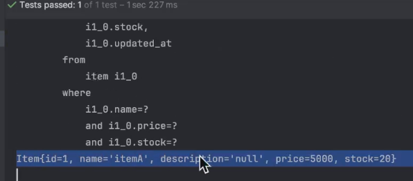

다음 단계: null을 무시하니까 힌트를 얻을 수 있다. booleanExpression을 반환하는 메서드로 분리를 해보자. 인자가  null이 아닐 때는 exprssion을 돌려주고, null일 때는 null을 돌려주겠금 만드는 메서드를 내가 만들고 싶은 조건에 따라서 하나씩 만들어 보자.

```java
    @Test
    public void dynamicQueryTester() {
        List<Item> results = null;
        String name = "itemA";
        Integer price = 5000;
        Integer stock = 20;

        //booleanExpression 사용============================================
        results = booleanExpressions(name, price, stock);
        results.forEach(System.out::println);

        results = booleanExpressions(name, null, null);
        results.forEach(System.out::println);

        results = booleanExpressions(null, null, stock);
        results.forEach(System.out::println);

        results = booleanExpressions(null, price, stock);
        results.forEach(System.out::println);
        
        results = booleanExpressions(null, null, null);
        results.forEach(System.out::println);
    }

    //BooleanBuilder 방식 말고 booleanExpression을 만들어서 where절에다가 지급을 해보자!
    public List<Item> booleanExpressions(
            String name,
            Integer price,
            Integer stock
    ) {
        return queryFactory
                .selectFrom(item)
                .where( //where절에다 뭘 넣고 싶은지
                        //아래와 같이 겨로가가 나오게끔 하고 싶은데,
                        //단 인자가 null 이라면 들어가지 않게끔 하고 싶다.
                        //-> where 메서드는 null을 인자로 받으면 무시한다.(where이 가지고 있는 특징)
//                        null, //null이 들어와도 무시를 한다. 문제가 생기지 않는다.
//                        null,
//                        item.name.eq(name),
                        nameEquals(name), //2. 이렇게 메서드로 받아올 수 있다.
//                        item.price.eq(price),
                        priceEquals(price),
//                        item.stock.eq(stock)
                        stockEquals(stock)
                )
                .fetch();
    }

    //1. 메서드를 만드어서 
    private BooleanExpression nameEquals(String name) {
//        if (name != null)
//            return item.name.eq(name);
//        return null;
        //null이라면 무시하고 그냥 null, null이 아니라면 만들어서
        return name != null ? item.name.eq(name) : null;
    }

    private BooleanExpression priceEquals(Integer price) {
        //null이라면 무시하고 그냥 null, null이 아니라면 만들어서
        return price != null ? item.price.eq(price) : null;
    }

    private BooleanExpression stockEquals(Integer stock) {
        //null이라면 무시하고 그냥 null, null이 아니라면 만들어서
        return stock != null ? item.stock.eq(stock) : null;
    }
```
결과출력  
첫번째 results = booleanExpressions(name, price, stock)  
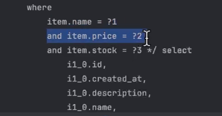

두번째 results = booleanExpressions(name, null, null)  
name만 출력  
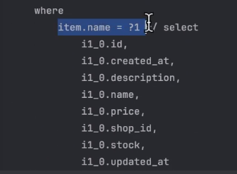

세번째 results = booleanExpressions(null, null, stock)  
stock만 출력  
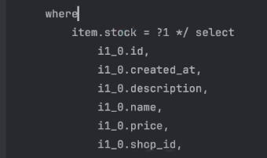

,,,,등등

마지막 null, null, null일 경우  
다시 말하지만 위의 결과가 문제가 생기지 않았던 것 처럼 where은 null을 무시하니깐 문제가 생기지 않는다. 모든 인자가 null이다, 조건이 들어가지 않는다.
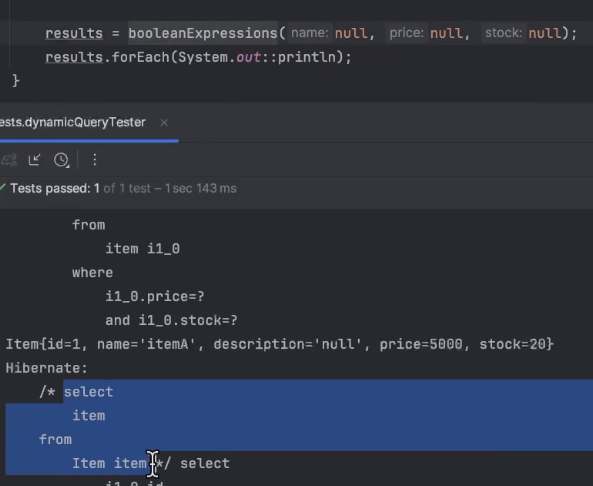  
단, 전체 null이면 검색이라고 동작을 하기 때문에 모든 것을 다 검색하겠다는 뜻이니까 막아야 한다.  
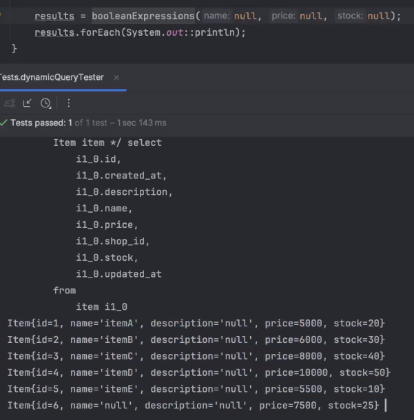  
모든 것을 조회할지 말지에 대한 null check를 해줄 필요가 있다.

.where()을 사용해 동적 쿼리를 진행하니 훨씬 코드가 간결해진다.  
BooleanBuilder코드  
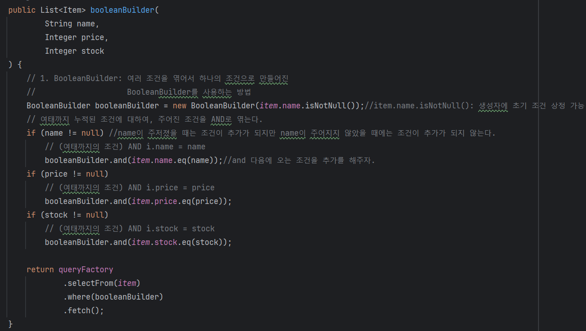  
.where()사용.  
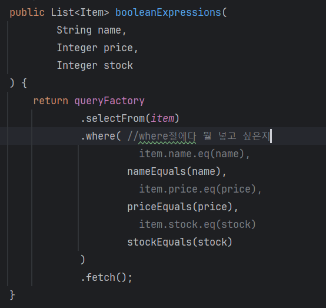

### .where()은 메서드를 사용하니까 재활용이 좋다. 조건을 나타내는 메서드를 만드는 것이기 때문에 조건의 재활용이 간편하다.

소분류나 대분류로 검색을 할 때 그 기준을 메서드 하나로 만들어 놓으면 모든 쇼핑물이 가지고 있는 상품들의 분류르 바탕을 검색을 하거나, 해당하는 쇼핑물을 기준으로 이 분류에 해당하는 물품을 검색할 때 이 똑같은 메서드를 한번 더 사용할 수 있을 것이다.

아니면 다른 방법으로는 메서드를 다시 메서드 내부에서 사용해 볼 수 있다.  
최젓값과 최곳값으로 검색을 해보고 최젓값이 정해져 있으면 최젓값으로 검색, 최곳값이 정해져 있으면 최곳값으로 검색, 둘 다 정해져 있으면 사잇값으로 검색을 해보자.  

```java
    @Test
    public void dynamicQueryTester() {
        //최젓값 최댓값 BooleanExpression으로
        results = goeOrLoeOrBetween(6000, null);
        results.forEach(System.out::println);
        results = goeOrLoeOrBetween(null, 6000);
        results.forEach(System.out::println);
        results = goeOrLoeOrBetween(5500, 7500);
        results.forEach(System.out::println);
    } 

    //최저값으로 정해져 있으면 최소값으로 검색, 최고값만 정해져 있으면 최고값으로 검색,
    //둘 다 정해져 있으면 사이값을 기준으로 검색을 한다.
    public List<Item> goeOrLoeOrBetween(
            //둘 다 있으면 사이값
            //하나만 있으면 floor은 최솟값, Ceil은 최댓값
            Integer priceFloor,
            Integer priceCeil
    ) {
        return queryFactory
                .selectFrom(item)
                .where(
                        priceBetween(priceFloor, priceCeil)
                )
                .fetch();
    }

    private BooleanExpression priceBetween(Integer floor, Integer ceil) {
        if (floor == null && ceil == null) return null;
        if (floor == null) return priceLoe(ceil); //최젓값이 정해지지 않았으니 최곳값보다 작거나 같은게 필요, 최곳값으로 검색.
        if (ceil == null) return  priceGoe(floor); //최곳값이 정해지지 않았으니 최젓값보다 크거나 같은게 필요, 최젓값으로 검색.
        //priceLoe, priceGoe 메스드들을 priceBetween메서드 내부에서 사용하고 있다.

        //최젓값과 최곳값이 정해져 있으면 그 사잇값을 기준으로 검색을 한다.
        return item.price.between(floor, ceil);
    }

    private BooleanExpression priceLoe(Integer price){ //작거나 같음
        return price != null ? item.price.loe(price) : null;
    }
    private BooleanExpression priceGoe(Integer price){ //크거나 같음
        return price != null ? item.price.goe(price) : null;

    }
```

가격을 기준으로 조회할 때, 본래는 이상 또는 이하만 제공하는 조건을 만들기 위해서, 메서드를 두가지 만들었다면 이후 두 조건이 있을때는 BETWEEN, 둘중 하나만 있을때는 이상 또는 이하 조건을 만들고자 한다면 해당 메서드를 다시 활용해볼 수 있습니다.

첫번째 조건 results = goeOrLoeOrBetween(6000, null);  
최솟값이 정해져 있으니 6000 보다 크거나 같은거를 검색.  
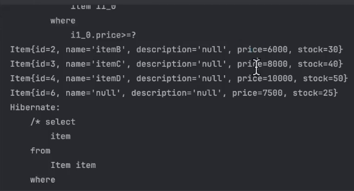  

두번째 조건 results = goeOrLoeOrBetween(null, 6000);  
최댓값이 정해져 있으니 6000보다 작거나 같은거를 검색.  
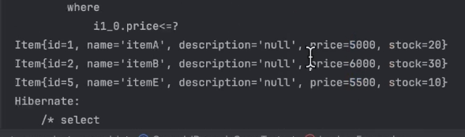

세번째 조건 results = goeOrLoeOrBetween(5500, 7500);  
최솟값과 최댓값이 정해져 있으니 5500과 7500의 샤잇값을 검색.  
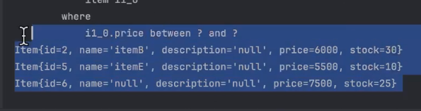

기능을 추가 시킬 수 있다. 구매를 하는 기능을 추가한다면 어떻게 할까?  
오버라이딩을 할 수 있다. 그리고 메서드들의 재활용을 할 수 있다.

```java
@Test
    public void dynamicQueryTester() {
        //최젓값 최댓값 BooleanExpression으로
        results = goeOrLoeOrBetween(6000, null);
        results.forEach(System.out::println);
        results = goeOrLoeOrBetween(null, 6000);
        results.forEach(System.out::println);
        results = goeOrLoeOrBetween(5500, 7500);
        results.forEach(System.out::println);
    }

    //즉시 구매 가능 기능 추가
    //호환성을 위해서 메서드 오버로딩을 한다.
    public List<Item> goeOrLoeOreBetween(
            Integer priceFloor,
            Integer priceCeil,
            boolean isAvailable //가격보기 + 구매하기
    ) {
        return queryFactory
                .selectFrom(item)
                .where(
                        priceBetween(priceFloor, priceCeil),
                        isAvailable(isAvailable)
                )
                .fetch();
    }

    private BooleanExpression isAvailable(boolean flag) {
        return flag ? item.stock.goe(1) : null; //참이면 재고가 1이상인지를 확인한다.
    }

    //최저값으로 정해져 있으면 최소값으로 검색, 최고값만 정해져 있으면 최고값으로 검색,
    //둘 다 정해져 있으면 사이값을 기준으로 검색을 한다.
    public List<Item> goeOrLoeOrBetween(
            //둘 다 있으면 사이값
            //하나만 있으면 floor은 최솟값, Ceil은 최댓값
            Integer priceFloor,
            Integer priceCeil
    ) {
        return goeOrLoeOreBetween(priceFloor, priceCeil, true);
    }

    //조건을 나타내는 메서드를 만드는 것이기 때문에
    //조건의 재활용이 간편하다.

    private BooleanExpression priceBetween(Integer floor, Integer ceil) {
        if (floor == null && ceil == null) return null;
        if (floor == null) return priceLoe(ceil); //최젓값이 정해지지 않았으니 최곳값보다 작거나 같은게 필요, 최곳값으로 검색.
        if (ceil == null) return  priceGoe(floor); //최곳값이 정해지지 않았으니 최젓값보다 크거나 같은게 필요, 최젓값으로 검색.

        //최젓값과 최곳값이 정해져 있으면 그 사잇값을 기준으로 검색을 한다.
        return item.price.between(floor, ceil);
    }

    private BooleanExpression priceLoe(Integer price){ //작거나 같음
        return price != null ? item.price.loe(price) : null;
    }
    private BooleanExpression priceGoe(Integer price){ //크거나 같음
        return price != null ? item.price.goe(price) : null;

    }
```
재고가 1이상인거 출력.(물론 최젓값과 최곳값의 조건에 해당하는)
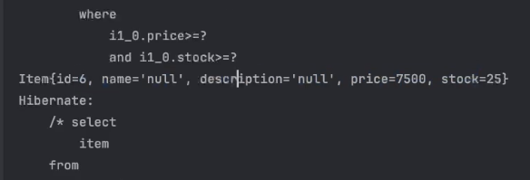