# Spring Security  
웹 어플리케이션의 보안 관련 설정을 쉽게 할 수 있도록 지워하는 프레임워크.  
추가만 해줘도 localhost:8080으로 가면 변화가 생긴다.

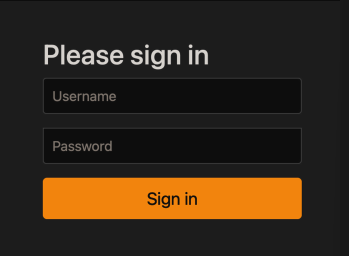

1. SecurityFilterChain() 빈 등록
@Configuartion + @Bean을 사용한다.  
@Bean - SecurityFilterChain 빈 메서드를 주입한다.  
=> Spring Security가 이 Bean을 객체로 설정을 변경한다.  
SecurityFilterChain():  
다양한 보안 관련 작업을 수행하기 위해 여러 개의 필터를 제공, 이러한 필터들을 필터체인에 연결하여 사용한다.  
일반적으로 Spring Security 설정 클래스에서 정의된다.  
HttpSecurity http:  
Spring Security에서 제공하는 클래스로, 웹 보안 구성을 정의하는데 사용된다.  
HttpSecurity를 구성한 후 최종적으로 빌드하는 메서드: return http.build();  
http.build()를 호출하면 HttpSecurity 객체가 반환되어 설정이 완료된 것으로 간주됩니다.

http.authorizeHttpRequests():  
http 요청에 대한 권한을 설정한다.  

.requestMatchers(URL): 원하는 URL패턴에 대한 권한 지정.

.permitAll(): 모든 사용자의 접근을 허용한다. (로그인한 사용자 & 로그인하지 않은 사용자 모두)    
즉, 해당 url에 대한 인증 또는 궈한 검사를 하지 않고 모든 요청을 허용한다.  
=> 로그인을 하지 않아도 접근 가능한 페이지.

.authenticated(): 인증된 사용자에게만 허용되도록 설정.  
즉, 해당 url에 대한 접근은 인증된 사용자에게만 허용된다.  
=> 로그인한 사용자에 대해서만 접근이 허용되는 페이지.

.anonymous(): (오직) 익명 사용자의 접근을 허용할 수 있다.(로그인한 사용자는 접근 할 수 없음.)  
즉, 해당 URL에 대한 인증을 받지 않은 사용자도 접근이 가능하다.

.anyRequest().authenticated(): 그 외 다른 요청은 인증된 사용자만 볼 수 있다. (인증이 필요한 요청)

- 로그인 / 로그아웃
http .formLogin(), http.logout()

http  
.formLogin() //form 기반 로그인에 대한 설정  
    .loginPage(URL) //로그인 페이지 지정, 로그인을 할 수 있는 여건이 되어있어야 하는 페이지이어야 한다.(아이디, 비밀번호 등)    
    .defalutSuccessUrl(URL) //로그인 성공 했을 시 이동할 페이지 지정  
    .failureUrl(URL) //로그인 실패 시 이동할 페이지 지정.

.logout()  
    .logoutUrl(URL) //로그아웃 url 지정. 이 url이 호출되면 로그아웃 되어야 한다. 
    .logoutSuccessUrl(URL) //로그아웃 성공 시 이동할 페이지 지정.    

```
authenticated()	인증된 사용자의 접근을 허용

fullyAuthenticated()	인증된 사용자의 
접근을 허용, rememberMe 인증 제외

permitAll()	무조건 접근을 허용

denyAll()	무조건 접근을 허용하지 않음

anonymous()	익명사용자의 접근을 허용

rememberMe()	기억하기를 통해 인증된 사용자의 접근을 허용

access(String)	주어진 SpEL 표현식의 평가 결과가 true이면 접근을 허용

hasRole(String)	사용자가 주어진 역할이 있다면 접근을 허용

hasAuthority(String)	사용자가 주어진 권한이 있다면

hasAnyRole(String...)	사용자가 주어진 권한이 있다면 접근을 허용

hasAnyAuthority(String...)	사용자가 주어진 권한 중 어떤 것이라도 있다면 접근을 
허용

hasIpAddress(String)	주어진 IP로부터 요청이 왔다면 접근을 허용
```

2. passwordEncoder 빈 등록  
비밀번호 암호화를 위한 passwordEncoder Bean 등록.
```java  
@Bean
//비밀번호 암호화 클래스
public PasswordEncoder passwordEncoder() {
    return new BCryptPasswordEncoder();
}
```
비밀번호를 안전하게 저장하고 검증하기 위한 인터페이스.  
비밀번호를 hasing하고 salting하는 등의 기능을 제공하여 보안을 강화한다.  
주로 사용자의 비밀번호를 데이터베이스에 저장할 때 사용된다.

원본 비밀번호를 안전한 방식으로 저장하고, 사용자가 로그인할 때 입력한 비밀번호와 저장된 비밀번호를 비교할 때 안전하게 비교할 수 있다.  
상용자의 비밀번호를 저장할 때는 안전을 위해 입력된 비밀번호와 저장된 비밀번호를 비교하여 인증을 수행해야 한다.

PasswordEncoder 구현체 중 하나는 BCryptPasswordEncoder이다.  
강력한 해싱 알고리즘인 BCrypt를 사용하여 비밀번호를 해싱하고 저장한다.

3. UserDetailsManager 빈 등록
사용자 계정의 CRUD작업과 관련된 메서드를 정의한다.  
이 인터페이스를 구현하는 클래스는 사용자 계증을 관리하는 역할을 담당한다.  
상요자의 로그인 정보, 권한 등을 저장하고 관리할 수 있다.  
로그인 가정을 진행하기 위해 사용하는 인터페이스.  
개발자가 Bean 객체로 등록할 시 로그인 과정을 커스텀할 수 있다.

UserDetailsManager의 구현체 중 하나는 InMemoryUserDetailsManager이다.  
메모리에 사용자 정보를 저장하며, 간단한 애플리케이션 또는 테스트용으로 사용된다.  
테스트용 구현체라고 보면 된다.  
데이터베이스와 연동하여 사용자 정보를 저장하고 관리하는 구현체를 많이 사용한다.

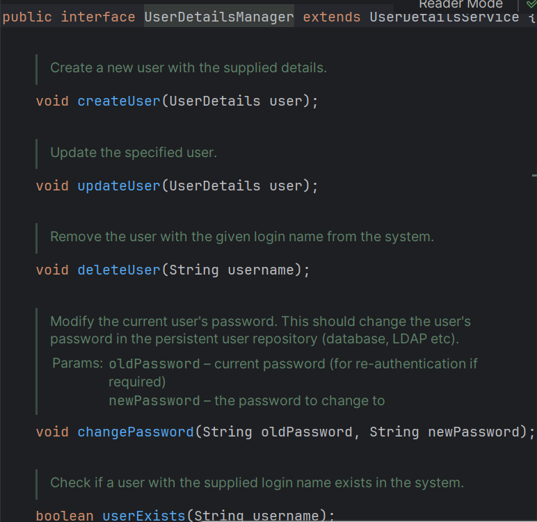

UserDetailsManager는 createUser, updateUser 등 기능을 가지고 있다.  
InMemoryUserDetailsManager은 이의 구현체이므로 오버라이드로 UserDetailsManager의 기능을 사용할 수 있다.

## 회원가입 방법(가입방법)
UserDetailsManager와 PasswordEncoder로 할 수 있다.  
User.withusename(username).password를 사용할 수 있다.

1. 미리 UserDetailsManager 빈에 등록 가능.(회원가입을 하지 않고 미리 주입. 즉, 테스트용) 
```java
@Bean
//사용자 정보 관리 클래스
public UserDetailsManager userDetailsManger(
        PasswordEncoder passwordEncoder
) {
    UserDetails user1 =
            User.withUsername("user1")
                    .password(passwordEncoder.encode("password1"))
                    .build();
    //스프링 시큐리티에서 기본적으로 제공하는
    //메모리 기반 사용자 관리 클래스
    //사용자 정보를 맵을 저장을 한다.
    return new InMemoryUserDetailsManager(user1);
}
```

2. 회원가입 페이지에서 회워가입을 하는 방법.(정상적 방법 회원가입)
```java
@Controller
public class UserController {
    private final UserDetailsManager manager;
    private final PasswordEncoder passwordEncoder;

    @PostMapping("/register")
    public String signUpRequest(
        @RequestParam("username")
        String username,
        @RequestParam("password")
        String password,
        @RequestParam("password-check")
        String passwordCheck
) {
    //TODO password == passwordCheck
    if (password.equals(passwordCheck))
        //@RequestParam을 사용해서 null이 될 수 없다.
        //null이면 에러
        //회원가입 과정.
        manager.createUser(User.withUsername(username)
                .password(passwordEncoder.encode(password))
                .build()
        );
    //TODO 주어진 정보를 바탕으로 새로운 사용자 생성
    //회원가입 성공 후 로그인 페이지로
    return "redirect:/users/login";
 }
}
```
model
thmyleaf extras
스프링 requestMapping handelr가 지원해주는 기능 중 하나

Authentication:  
Controller에서 접속한게 누군지 확인을 할 때 사용(매개변수로 받으면 된다.)  
컨트롤러에서 메소드의 매개변수로 넣어줄 수 있다.  
인증 정보를 나타내는 인터페이스.  
사용자의 인증 정보와 권한을 포함하고 있다.  
사용자의 이름, 패스워드, 권한 등의 정보를 가지고 있다.  
성공적으로 로그인한 경우 해당 정보가 포함되고,  
로그아웃 또는 세션이 만료된 경우 Authentication객체는 빈 상태로 설정된다. 
```java
//인증된 사용자 이름(이름 외 비밀번호나 다른 사용자 정보를 가져올 수 없다.)    
log.info(authentication.getName());  
//사용자의 정보를 가져오려면 getPrincipal이 필요. User로 형변환이 필요하다.  
log.info(((User)authentication.getPrincipal()).getPassword());  
log.info(((User)authentication.getPrincipal()).getUsername());
```    
getPrincipal을 해야 사용자의 정보를 알 수 있다.

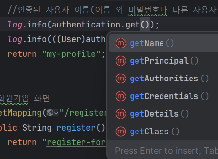

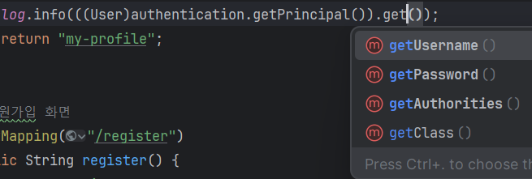

## sec:authorize 홈에서 로그인을 하고 로그인을 한 후 다시 홈으로 왔을 때 로그인 유지를 할 수 있는 방법.
sec:authorize: 로그인을 했냐 안했냐에 따라서 다른 내용을 보여주고 싶을 때 사용.  
sec:authorize="isAnonymous()": 인증 안 된 사용자만 볼 수 있다.  
sec:authorize="isAuthenticated()": 인증 된 사용자만 볼 수 있다.  
sec:authentication="name": 인증된 사용자 이름을 출력해준다.

```html
<div sec:authorize="isAnonymous()">
    <a href="/users/login">로그인</a>
    <a href="/users/register">회원가입</a>
</div>
<!--로그인을 하고 다시 홈으로 돌아왔을 때 로그인 상태가 유지되며,
    반갑습니다,,,가 나오게 된다. -->
<div sec:authorize="isAuthenticated()">
    <h3>반갑습니다, <span sec:authentication="name"></span>님!</h3>
    <form action="/users/logout" method="post">
        <input type="submit" value="로그아웃">
    </form>
```

/home에서 로그인을 한다.  


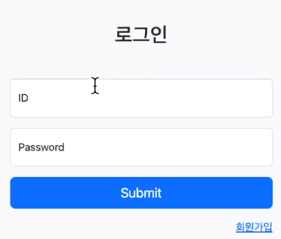

/로그인을 성공하면 my0profile로 이동  
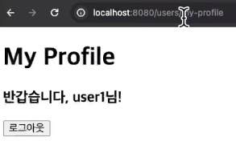

로그인을 하고 다시 /home으로 돌아왔는데 로그인 상태가 유지되어 있다.  
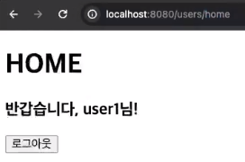

## 컨트롤러에서만 누가 요청을 했는지 받을 수 있느냐?
//어디에서든 현재 요청에 대해서 누가 접속을 해서 요청을 했는지 알 수 있다.  
```java
log.info(SecurityContextHolder.getContext().getAuthentication().getName());
```  
SecurityContextHolder는 스프링 Security에서 현재 사용자의 인증 정보(Authentication)를 제공하는 클래스이다.  
주로 스레드 로컬(ThreadLocal)을 사용하여 현재 스레드의 보안 컨텍스트를 관리한다.  
누가 접속했는지에 대한 정보를 가지고 있다.  
이 클래스의 메서드들은 정적(static) 메서드로 구성되어 있어서 직접 객체를 생성하거나 초기화할 필요 없이 사용할 수 있습니다.  
길어서 주로 다른 클래스에 짱박아 놓고 불러오는 메서드 하나만 만들어 놓고 사용하는 경우가 많다.

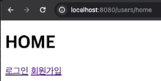
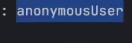

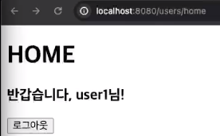
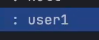

