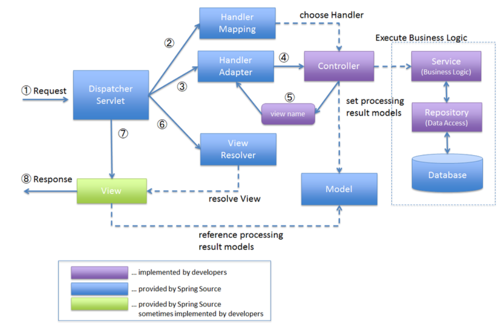

# MVC 패턴
  
1. 보안을 위한 단 하나의 입구로 요청을 받는다.
2. 사용하기 적합한 컨트롤러를 찾는다.
3. 적합한 컨트롤러를 찾았으면 요청을 보낸다.
4. 컨트롤러는 요청을 처리할 수 있는 매핑을 찾고 Service에게 위임한다.
5. 저장소와 관련이 있다면 관련 처리를 Repository에 위임한다.
6. 요청된 것의 결과를 받은 컨트롤러는 Model과 함께 view에 보여줄것을 서블릿에 전달한다.
7. 서블릿은 View Resolver에게 전달한다.
8. View Resolver는 View를 찾아 반환한다.
9. View에게 정보를 준다.
10. View는 클리이언트에게 응답을 준다.

*의문: 스프링빈 컨테이너는 어느 시점에 동작하는 것인가?

# @Controller
스프링 MVC 컨트롤러로 인식.  
주로 View를 반환하기 위해 사용한다.    
요청을 받아 처리 한 후 지정된 뷰에 화면에 필요한 것들을 담아 Model객체를 넘겨주는 역할.  
사용자의 요청이 진입하는 지점.  
요청에 따라 어떤 처리를 할지 결정을 Service에 넘겨준다.  
Service에서 실질적으로 처리한 내용을 View에 넘겨준다.  
즉, @Service와 의존관계를 맺는다.

여러 서비스가 있을 경우,  
A 서비스를 A-Controller가 처리,  
B 서비스를 B-Controller가 처리,  
C 서비스를 C-Controller가 따로 처리할 수 있도록 해준다.

# @Service
특별한 처리를 하지 않는다. 개발자들이 핵심 비지니스 로직이 여기에 있겠구나 라고 비지니스 계층을 인식하는데 도움이 된다.  
Service가 알맞은 정보를 가공하는 과정을 '비지니스 로직을 수행한다.'라고 한다.

# @Repositoty
스프링 데이터 접근 계층으로 인식하고, 데이터 계층의 예외를 스프링 예외로 변환해 준다.


### 컨트롤러와 뷰를 쪼개는게 기본. 뷰는 화면에 나타내는 것만, 비지니스 로직은 컨트롤러로 처리하고 Model에 화면에 필요한 것을 담아서 화면쪽에 넘겨주는 패턴.

# 싱글톤 패턴
생성자 주입일 경우:  
스프링 컨테이너가 실행될 때, 단 한번 실행되고 그때 만들어진 값을 공유한다.  
요청이 올 때 마다 이미 만들어진 값(빈)을 공유한다.  
불변이다.(private)  
조회밖에 할 수 없다.  
스프링은 기본이 싱글톤이고 생성자 주입을 사용한다.(그래서 생성자(주입)이 하나 있으면 @Autowried를 생략가능하다.)

# 의문점  
이론적으로는 미리 공부도 하고 강사님의 좋은 강의로 어느정도 알게 되었다고 생각한다. 하지만 코드로 보면 어느 시점에서 스프링 컨테이너가 실행되는지, 이게 왜 싱글톤인지를 잘 알지 못하겠다.  

```java
@Controller
@RequestMapping("/member")
@RequiredArgsConstructor
public class MemberController {
    private final MemberService memberService;

    @GetMapping("/add")
    public String addForm() {
        return "memberForm2";
    }

    @PostMapping("/add")
    public String add(@ModelAttribute Member member, Model model) {
        memberService.joinMember(member);

        model.addAttribute("member", member);

        return "memberView";
    }

    @GetMapping("/list")
    public String list(Model model) {
        List<Member> memberList = memberService.getMembers();
        model.addAttribute("members", memberList);
        return "memberList";
    }

    @GetMapping("/update") //업데이트 ?id=kang
    public String updateForm(@RequestParam String id, Model model) {
        Member member = memberService.getMember(id);
        model.addAttribute("member", member);
        return "memberUpdateForm";
    }

    @PostMapping("/update") //업데이트한거를 저장
    public String update(@ModelAttribute Member member) {
        memberService.updateMember(member);
        return "redirect:/member/list";
    }

    @GetMapping("/delete")
    public String delete(@RequestParam String id, Model model) {
        memberService.delete(id);
        return "redirect:/member/list";
    }
```  
예를들면

localhost:8080/member 이런 요청이 들어오기 전에 싱글톤은 스프링컨테이너가 실행 될 때 스프링 빈을 등록하고, 의존관계주입까지 완료한다. 그리고 요청이 들어오면 생성한 빈을 공유한다. 

라는 이론적인 지식은 있지만 
이게 이 코드에서 어떻게 수행되는지 잘 모르겠다. 

(코드 실행되기 전에 스프링컨테이너는 스프링이 동작 과정에서 만들어지는것인가??)

(private final MemberService memberService; 이 부분이 생성자 주입인건 알겠는데 즉, 이게 싱글톤이라는 건가?)

너무 많은 내용이 들어와 이 지식과 저 지식이 뒤섞여진듯하다.


