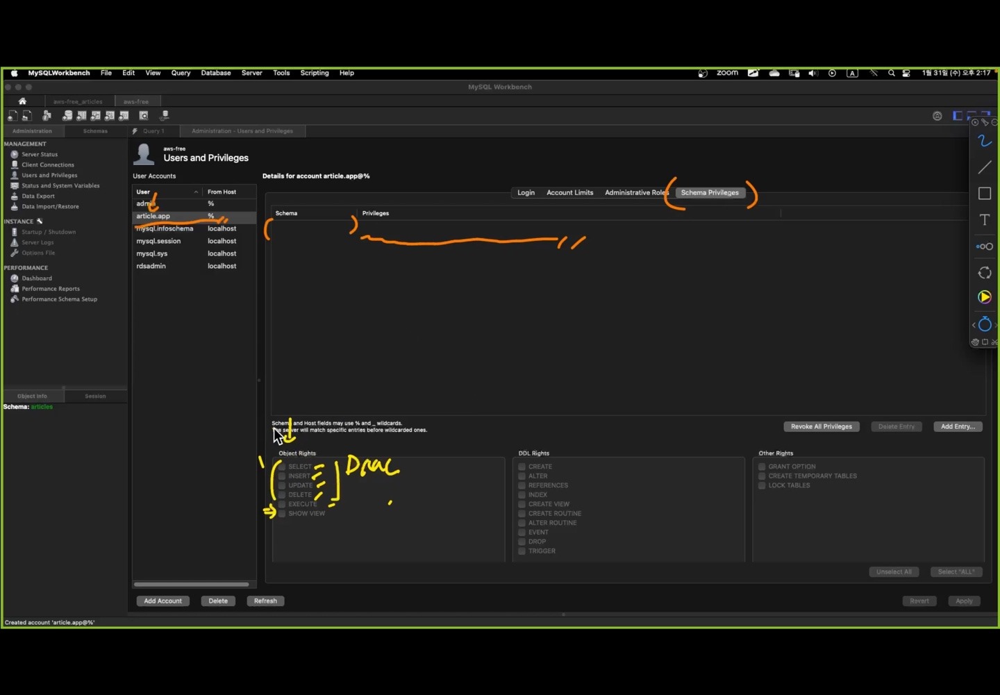

# RDBMS
기본적으로 시중의 RDBMS는 서버 클라이언트 방식으로 작동한다.  
데이터베이스 서버와 소통하기 위해 workbench를 사용한다.(서버를 사용할 클라이언트 역할)

# RDS
aws에서 제공하는 관리된 Database 클라우드 서비스.  
관계형 데이터베이스를 전문으로 다룬다.

mysql은 sql 표준을 잘지키는 dbms

aws의 RDS를 이용해서 mysql을 사용했습니다.
인덱스 뷰 => ㅡmysql에서 사용한 조금 다른 기능? 좋은기능?

인텔리제이에서 사용하는 데이터그립 도구는 수많은 데이터소스를 대상으로 동작을 할 수 잇게 만들어져 있어
workbench같이 딱 만들어져 있는 데이터베이스 툴 보다는 전문성이 떨어진다. 관리하기 편하게 하려고 workbeanch사용. 

인증과 인가 ,스키마 접근 설정을 해주는게 좋다.

목적에 맞게끔 데이터 스키마를 구분을 하고 게시글 서비스라면 게시글 스키마를 만들고 거기 안에다가만 만들고  

간단한 쿼리문 인텔리제이 스키마 관리-workbench

# RDS
엔드포인트 중요.


 mysql 선택 -> 포트 3306, ssh필요없음


workbench에 RDS랑 연동.


```java
spring:
  datasource:
    driver-class-name: com.mysql.cj.jdbc.Driver
    username: article.app
    password: Qlsdl2314 # ${MYSQL_PASSWORD}
    # url: jdbc:mysql://<host>:<port>/<schema>
    url: jdbc:mysql://<RDS엔드포인트>:3306/articles
  jpa:
    database: mysql
    hibernate:
      # ddl-auto를 한번도 안 쓸 수 있다.
      # 단 그 경우 entity클래스의 정의와 완벽히 일치하는 테이블이
      # 사용하고자 하는 데이터베이스에 잘 만들어져 있어야 한다.
      ddl-auto: create
    show-sql: false
```
이제 엔티티를 만들고 저장을 하면 mysql과 연결이 된다.


# workbench 스키마 구분하여 사용하기.

스키마별로 따로 관리하기: 개발용, 배포용 등 각자 용도로 사용할 수 있다. 다른 스키마는 침범하지 못한다.  
duplicate -  default schema에 디폴트로 관리할 스키마 이름 삽입. 그 스키마만 사용가능한 용도의 공간이다.


admin계정은 모든 스키마에 접근이 가능하니 다른 계정을 만들어 정해진 스키마만 접근이 가능하도록 계정을 만들자.


사용권한 설정. SelectAll-apply  


만들어진 계정으로 Username을 바꾸어 준다.  


이제 sys 등 다른 스키마를 볼 수 없다. 오직 article 스키마를 사용하는데 모든 권한을 받았지만, 다른 스키마를 사용하는데에 대한 궈한은 전혀 없게된다. use sys등을 사용해도 볼 수 없다.  


